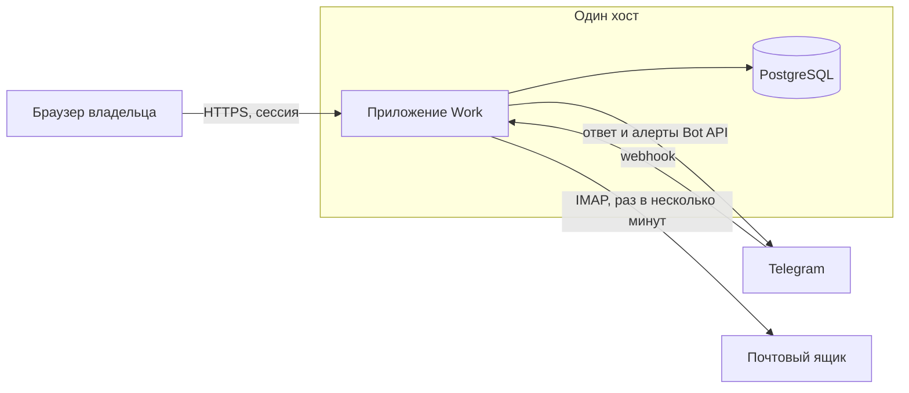
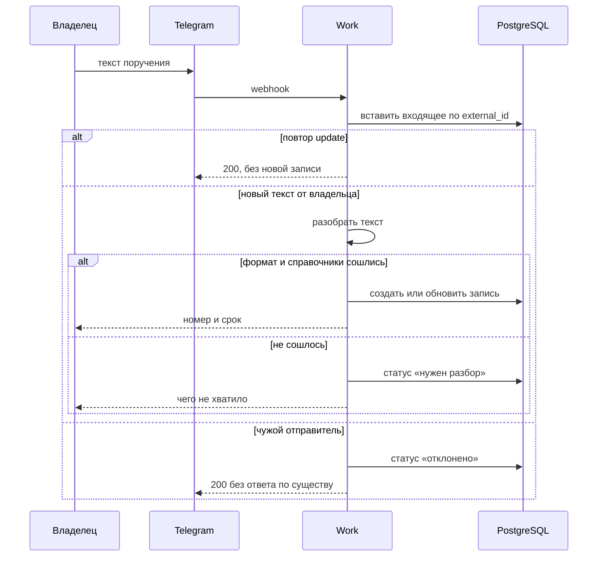
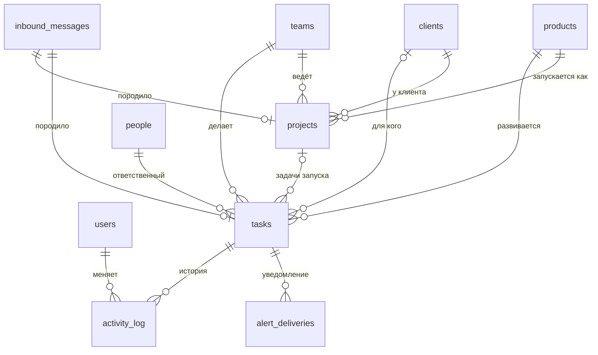

# Архитектура: Work

Как устроено приложение из [технического задания](TZ.md). Документ рассчитан на реализацию без повторного выбора стека и границ модулей.

## 1. Какую нагрузку держим

Один владелец, позже несколько коллег. До пары тысяч живых записей, десятки входящих сообщений в день, одна утренняя сводка и редкие разовые оповещения.

Отсюда следствие: один сервис, одна база, один фоновый цикл. Очередь сообщений, отдельный поисковый движок и набор микросервисов этой нагрузке не нужны и добавляют места, где поручение может потеряться.

## 2. Из чего состоит система



Приложение — один процесс на TypeScript. В нём веб-интерфейс, HTTP API, приём webhook, разбор текста и фоновые проверки. PostgreSQL — единственное хранилище: записи, сырые входящие, журнал доставок.

Почта наружу сама ничего не вызывает. Приложение забирает новые письма само. Так не нужен платный inbound-шлюз и проброс корпоративной почты в публичный webhook.

## 3. Стек

| Слой | Выбор | Почему |
| --- | --- | --- |
| Приложение | Next.js, TypeScript | Интерфейс и API в одном репозитории и одном деплое |
| База | PostgreSQL 16 | Одновременные запись из webhook и фоновая проверка, нормальные ограничения целостности |
| Доступ к данным | SQL-модуль с параметризованными запросами | Объём схемы маленький, поведение сроков и фильтров лучше видно в запросе |
| Пароли | Argon2id | Стойкий хеш пароля владельца |
| Сессия | Подписанная httpOnly-cookie | Отдельный сервер сессий не нужен |
| Почта на вход | IMAP | Ящик уже есть, опрос дешевле отдельного сервиса приёма писем |
| Оповещения | Telegram Bot API | Бесплатно, пуш, тот же бот, что принимает поручения |

Redis, брокер очередей и отдельный worker-процесс не вводятся. Фоновый цикл живёт в том же приложении и берёт блокировку в Postgres, чтобы второй экземпляр не отправил сводку дважды.

## 4. Модули

Зависимости идут внутрь: HTTP и каналы вызывают прикладные сценарии, сценарии вызывают разбор и базу. Разбор текста не знает про Telegram и почту.

```text
src/
  app/                экраны и маршруты HTTP
  modules/
    auth/             вход, сессия, роль
    catalog/          продукты, клиенты, команды, люди
    projects/         проекты
    work/             задачи проекта и бэклог, фильтры, подсветка
    intake/           сохранение сырого сообщения и проведение
    parse/            чистая функция разбора текста
    notify/           окно 14 дней, сводка, доставка в Telegram
    activity/         история изменений
  db/                 схема, запросы, миграции
```

`parse` покрывается тестами без базы и без сети. `work` считает «горит / просрочено / без срока» одним правилом, которым пользуются и списки, и оповещения. Второй реализации этого правила в интерфейсе нет: экран получает уже посчитанный признак.

## 5. Потоки

### 5.1. Ручное создание

Форма вызывает тот же сценарий, что и проведение входящего. Проверка обязательных полей одна. После записи пишется история «создано».

### 5.2. Сообщение Telegram



Webhook отвечает быстро. Сетевой вызов к Bot API с текстом ответа идёт после фиксации входящего в базе. Если ответ не дошёл, запись уже есть: владелец увидит её в списке, Telegram может повторить webhook, а `external_id` не даст создать дубль.

### 5.3. Письмо

Раз в несколько минут цикл открывает IMAP и берёт непрочитанные письма, тема которых начинается с `[Work]`. Идентификатор письма — заголовок `Message-ID`. После сохранения входящего письмо помечается прочитанным.

Письмо разрешённого отправителя идёт тем же сценарием, что Telegram: разбор, создание или очередь. Письмо с префиксом от чужого адреса сохраняется как отклонённое и запись не создаёт. Письма без префикса цикл не забирает, обычная почта ящика в контур не попадает.

Ответное письмо владельцу — необязательное подтверждение тем же разбором. Ошибка SMTP не откатывает уже созданную задачу.

### 5.4. Оповещение

Раз в час цикл выбирает открытые записи, которые горят или просрочены, и у которых пуста отметка разового сообщения. Для каждой создаёт строку доставки и отправляет сообщение. Успех проставляет доставку и записывает в отметку срок, по которому сообщение ушло. Ошибка оставляет доставку неуспешной, отметку не ставит, следующий час пробует снова. Пока владелец ни разу не написал боту и чат неизвестен, доставка завершается ошибкой и видна на обзоре: запись при этом не теряется.

Отдельно, в 09:00 `Europe/Moscow` по понедельникам–пятницам, цикл собирает одну сводку. Признак «сводка за эту дату уже ушла» хранится в базе под блокировкой.

Перенос срока за пределы окна очищает отметку разового сообщения в том же изменении, что и сам срок. Это делает сценарий обновления, а не рассылка.

## 6. Модель данных

Идентификаторы — `uuid`. Время события — `timestamptz`. Срок — тип `date`, без времени суток.



### 6.1. Таблицы

`users`

- `id`, `email` уникален, `name`, `password_hash`, `role` (`owner`, `editor`, `viewer`)
- `telegram_user_id`, `telegram_chat_id` — пустые, пока владелец не написал боту

`products`, `clients`, `teams`

- `id`, `name`, `archived_at`
- уникальность имени: индекс по `lower(btrim(name))`

`people`

- `id`, `name`, `team_id` nullable, `archived_at`
- уникальность имени такая же

`projects`

- `id`, `number` уникален, `name`, `product_id`, `client_id`, `team_id`
- `status`: `draft`, `preparing`, `active`, `paused`, `launched`, `cancelled`
- `due_date` nullable, `summary`, `created_by`, `created_at`, `updated_at`

`tasks` — и задачи проекта, и бэклог

- `id`, `kind` (`project_task`, `backlog`), `number` уникален
- `description`, `external_number` nullable
- `project_id` nullable, `product_id`, `team_id`, `person_id`
- `client_id` nullable
- `beneficiary` nullable: `client`, `all_clients`, `internal`
- `side` nullable: `ours`, `client`, `partner`
- `status`
- `due_date` nullable
- `t14_due_date` — срок, по которому уже ушло разовое сообщение; пусто, если не уходило
- `source`: `manual`, `telegram`, `email`
- `inbound_message_id` nullable
- `created_by`, `created_at`, `updated_at`

`inbound_messages`

- `id`, `channel` (`telegram`, `email`), `external_id`
- уникальность пары (`channel`, `external_id`)
- `sender`, `raw_text`, `received_at`
- `parse_status`: `applied`, `needs_review`, `rejected`, `duplicate`
- `parse_error`, `parsed_json`
- `task_id` nullable, `project_id` nullable

`alert_deliveries`

- `id`, `kind` (`t14`, `digest`), `task_id` nullable, `digest_date` nullable
- `payload`, `status` (`pending`, `sent`, `failed`), `error`, `created_at`, `sent_at`
- для сводки уникальна пара (`kind = digest`, `digest_date`)

`activity_log`

- `id`, `actor_id`, `entity_type`, `entity_id`, `action`, `diff` jsonb, `created_at`
- строк истории не обновляют и не удаляют

`counters`

- `name` (`project`, `task`, `backlog`), `value`
- следующий номер берётся в той же транзакции, что и вставка записи: `UPDATE ... RETURNING`

### 6.2. Ограничения, которые держат смысл ТЗ

Задача проекта:

- `kind = project_task`
- `project_id`, `side` заполнены
- `beneficiary` пуст
- `status` один из `todo`, `in_progress`, `waiting`, `done`, `cancelled`

Пункт бэклога:

- `kind = backlog`
- `project_id` и `side` пусты
- `beneficiary` заполнен
- при `beneficiary = client` заполнен `client_id`
- `status` один из `backlog`, `in_sprint`, `done`, `cancelled`

Продукт задачи проекта не задаётся отдельно от проекта. При смене продукта у проекта фоновое обновление в той же транзакции проставляет `tasks.product_id` у его задач.

Закрывающие статусы записи: `done`, `cancelled`. Проектные статусы, при которых подсветка молчит: `paused`, `launched`, `cancelled`.

Признак на экране не хранится. Его считает один запрос, тем же правилом пользуется сводка. Закрытая запись отсекается раньше пустого срока, иначе сделанная задача без даты попадёт в блок «без срока»:

```sql
case
  when t.status in ('done', 'cancelled') then 'closed'
  when p.status in ('paused', 'launched', 'cancelled') then 'closed'
  when t.due_date is null then 'undated'
  when t.due_date < current_date then 'overdue'
  when t.due_date <= current_date + 14 then 'soon'
  else 'ok'
end
```

Для бэклога соединения с проектом нет, ветка статуса проекта не применяется. `current_date` в сессии базы выставлен в `Europe/Moscow`.

Сброс разового оповещения делается в том же обновлении, что и срок. Если новый `due_date` пуст или позже чем через 14 дней, `t14_due_date` очищается. Если новый срок всё ещё внутри окна, отметка не трогается: повтор той же волны не уходит, даже если дата внутри окна сменилась. Предикат отправки — пустая отметка, а не сравнение отметки с текущим сроком. После выхода из окна и нового входа отметка уже пустая, и сообщение уходит снова (FR-64).

Коды статусов в базе и подписи в интерфейсе:

| Подпись | Код |
| --- | --- |
| Черновик / Подготовка / В работе / Пауза / Запущен / Отменён | `draft` / `preparing` / `active` / `paused` / `launched` / `cancelled` |
| К выполнению / В работе / Ожидание / Готово / Отменено | `todo` / `in_progress` / `waiting` / `done` / `cancelled` |
| Бэклог / В спринте / Готово / Отменено | `backlog` / `in_sprint` / `done` / `cancelled` |
| Мы / Клиент / Партнёр | `ours` / `client` / `partner` |
| Все клиенты / Внутреннее / конкретный клиент | `all_clients` / `internal` / `client` |

### 6.3. Фильтры в запросе

Контрольная дата `due_on_or_before`:

```sql
due_date is not null and due_date <= $date
```

Команда, продукт и клиент на проектах — поля проекта. На бэклоге команда — `tasks.team_id`, продукт — `tasks.product_id`. Клиент на бэклоге:

```sql
beneficiary = 'all_clients'
or (beneficiary = 'client' and client_id = $client)
```

При выбранном клиенте внутренние пункты не возвращаются. При пустом клиенте условия на адресата нет.

Индексы: `tasks(kind, status)`, `tasks(team_id)`, `tasks(product_id)`, `tasks(client_id)`, `tasks(due_date)`, `tasks(project_id)`, `projects(team_id)`, `projects(product_id)`, `projects(client_id)`, `projects(due_date)`.

## 7. Разбор текста

Модуль `parse` принимает строку и возвращает одно из двух:

- команду создания или обновления с полями;
- список ошибок: неизвестный тип, нет ключа, кривая дата, неизвестное значение статуса или стороны.

Он не ходит в справочники. Существование продукта, клиента, команды и номера проверяет сценарий `intake` уже по базе. Так одно и то же сообщение можно разобрать в тесте и провести позже из очереди, когда справочник дополнят.

Правила разбора совпадают с разделом 10 ТЗ. Известные ключи заданы списком. Строка без двоеточия, идущая после `Описание:`, дописывается к описанию. Неизвестный ключ — ошибка разбора, а не тихо отброшенное поле: иначе поручение сохранится неполным и будет выглядеть принятым.

Сопоставление имён справочников — точное, по `lower(btrim(name))`. Ближайшие имена можно показать в тексте ошибки как подсказку, но провести запись на «похожее» имя нельзя.

Ответственный ищется так же. Если имени нет, сценарий создаёт человека и подставляет его. Это единственный справочник, который пополняется из сообщения (FR-41).

## 8. API

Все маршруты ниже, кроме входа и webhook, требуют сессию. Ответы JSON. Ошибки проверки — `422` со списком полей. Чужие и несуществующие номера — `404`.

| Метод и путь | Назначение |
| --- | --- |
| `POST /api/session` | Вход |
| `DELETE /api/session` | Выход |
| `GET /api/overview` | Счётчики и короткий список внимания с учётом фильтров |
| `GET, POST /api/projects` | Список и создание |
| `GET, PATCH /api/projects/:number` | Карточка и правка |
| `GET, POST /api/tasks` | Список задач и бэклога, query: `kind`, `team`, `product`, `client`, `due`, `project` |
| `GET, PATCH /api/tasks/:number` | Карточка и правка |
| `GET /api/inbox` | Входящие, фильтр по статусу разбора |
| `POST /api/inbox/:id/apply` | Провести разобранное или поправленную форму |
| `POST /api/inbox/:id/reject` | Отклонить |
| `GET, POST, PATCH /api/products` и то же для `clients`, `teams`, `people` | Справочники |
| `POST /api/telegram/webhook` | Приём Telegram, без сессии, с секретом webhook |

Фильтры списков дублируются в query-страниц интерфейса, чтобы адрес из шапки открывал тот же срез (FR-34).

Команды изменения возвращают запись целиком, включая посчитанный признак срока. Интерфейс не пересчитывает окно сам.

## 9. Интерфейс

Серверные страницы:

- `/` — обзор
- `/projects`, `/projects/[number]`
- `/backlog`, `/tasks/[number]`
- `/inbox`, `/inbox/[id]`
- `/catalog`

Шапка с фильтрами общая. Формы создания — панели на списках, без отдельного мастера. Подсветка: просроченное и горящее различаются меткой и цветом строки, цвет не единственный носитель смысла.

Экран входящего показывает сырой текст неизменяемым и рядом форму проведения. Так исходное поручение не подменяется тем, как его понял разбор.

## 10. Безопасность

- Приложение слушает наружу только HTTPS.
- Cookie сессии: `httpOnly`, `Secure`, `SameSite=Lax`.
- Webhook Telegram проверяет секретный заголовок, который задаётся при установке webhook. Запрос без секрета не читает тело как поручение.
- `telegram_user_id` владельца задаётся в настройках окружения. Сообщение другого пользователя сохраняется как отклонённое, если секрет webhook верный, и отбрасывается, если неверный.
- Список адресов почты, с которых можно принять письмо, задаётся в окружении.
- Пароль почтового ящика, токен бота, секрет webhook и секрет сессии — только переменные окружения.
- Журнал приложения пишет номер записи и статус доставки, не пишет сырой текст поручения и не пишет секреты.
- Запросы к базе параметризованы.
- Роль в сессии уже проверяется на каждом изменяющем маршруте, даже пока в базе один владелец. Наблюдатель, когда появится, эти маршруты не проходит.

## 11. Развёртывание

Один небольшой виртуальный сервер. На нём два контейнера: приложение и PostgreSQL. Диск базы — том сервера.

Рядом по расписанию `pg_dump` раз в сутки, 14 последних копий на этом диске и копия на второй носитель или в объектное хранилище. Восстановление проверяется сценарием А13: чистая база, накат дампа, чтение проекта, задачи и сырого входящего.

Ориентир стоимости на описанный объём: сервер начального размера, домен и сертификат. Telegram и IMAP дополнительных платежей не требуют. Платный почтовый API и отдельная очередь в эту схему не входят.

Переменные окружения, без значений по умолчанию для секретов:

- `DATABASE_URL`
- `SESSION_SECRET`
- `OWNER_EMAIL`, `OWNER_PASSWORD_HASH`
- `TELEGRAM_BOT_TOKEN`, `TELEGRAM_WEBHOOK_SECRET`, `TELEGRAM_OWNER_USER_ID`
- `IMAP_HOST`, `IMAP_USER`, `IMAP_PASSWORD`, `IMAP_ALLOWED_FROM`
- `APP_BASE_URL`, `TZ=Europe/Moscow`

Срез 1 поднимается без переменных Telegram и IMAP: фоновый цикл в этом случае спит, подсветка в интерфейсе работает.

Ежедневный дамп включается в срезе 1, вместе с первыми живыми поручениями. Приёмка А13 относится к этому срезу.

## 12. Отказы

| Что случилось | Поведение |
| --- | --- |
| База недоступна | Запрос пользователя завершается ошибкой, сообщение Telegram не подтверждено бизнес-успехом. Webhook отвечает ошибкой, Telegram повторит доставку |
| Разбор одного письма упал | Это входящее помечается ошибкой, цикл идёт к следующему письму |
| Bot API недоступен | Доставка остаётся `failed`, отметка `t14_due_date` не ставится, час спустя будет новая попытка |
| Приложение лежало сутки | После старта часовая проверка отправит разовые сообщения за записи, которые уже внутри окна и ещё не отмечены. Утренняя сводка за пропущенный день не догоняется пачкой: уходит ближайшая утренняя |
| Два экземпляра приложения | Блокировка `pg_advisory_lock` на цикл оповещений и на цикл IMAP. Второй экземпляр цикл пропускает |
| Повтор webhook | Уникальность `external_id` возвращает уже сохранённый результат |

## 13. Наблюдаемость

На обзоре владельца, не в отдельной системе: число входящих в разборе, число неуспешных доставок за последние сутки, время последней успешной сводки. Этого достаточно, чтобы увидеть «оповещения не уходят» из FR и пометки в ТЗ.

Технический журнал процесса: старт, ошибка соединения с базой, ошибка IMAP, ошибка Bot API без текста сообщения.

## 14. Проверка

Тесты на чистых функциях и на базе, без внешнего Telegram:

- разбор каждого примера из раздела 10 ТЗ и каждого отказа: нет поля, кривая дата, неизвестный ключ, обновление чужим типом;
- признак `soon`, `overdue`, `undated`, `closed`, включая проект на паузе;
- сброс `t14_due_date` при переносе срока за окно и сохранение отметки при переносе внутри окна;
- фильтр продукта на проектах и в бэклоге;
- фильтр клиента для трёх видов «для кого»;
- уникальность номера при двух одновременных вставках;
- повтор `external_id` не создаёт вторую задачу.

Приёмка А1–А13 из ТЗ проходит на собранном стенде. Срезы 2 и 3 дополнительно гоняются с тестовым ботом и тестовым ящиком.

## 15. Что меняется, когда появятся коллеги

Модель к этому уже готова: `users.role`, `created_by`, история с автором, фильтры в адресе.

Добавится, и только это:

- приглашение по почте и установка пароля;
- запрет изменяющих маршрутов для наблюдателя;
- отдельный `telegram_user_id` у редактора, если редактору тоже можно писать боту;
- сводка по-прежнему одна, владельцу. Личные сводки коллег — отдельное решение, в эту архитектуру не заложено как обязательное.

Менять таблицу задач и правила срока для этого не нужно.

## 16. Соответствие требованиям

| Требование ТЗ | Где обеспечивается |
| --- | --- |
| FR-1–FR-3 | `auth`, cookie, `created_by` |
| FR-10–FR-24 | `projects`, `work`, ограничения `tasks` |
| FR-30–FR-35 | один запрос фильтра, query в адресе, обзор на тех же параметрах |
| FR-40–FR-43 | общий сценарий создания для формы и входящих |
| FR-50–FR-58 | `intake` + `parse`, уникальность `external_id` |
| FR-60–FR-68 | вычисляемый признак, `notify`, `alert_deliveries` |
| FR-70–FR-71 | `activity_log` без обновления |
| NFR-2–NFR-5, NFR-7 | HTTPS, секреты в окружении, Argon2id, `pg_dump`, идемпотентность webhook |
